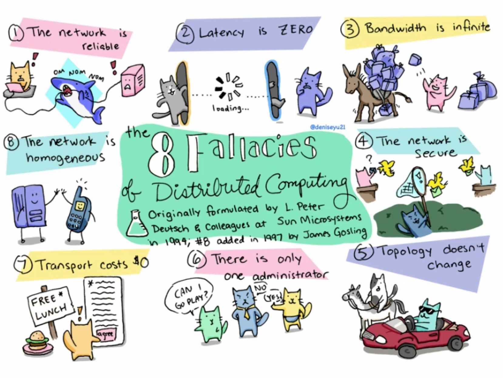

# Distributed computing

分散式運算（英語：Distributed computing），主要研究分散式系統（Distributed system）如何進行計算。分散式系統是一組電腦，透過網路相互連接傳遞訊息與通訊後並協調它們的行為而形成的系統。組件之間彼此進行互動以實現一個共同的目標。把需要進行大量計算的工程資料分割成小塊，由多台電腦分別計算，再上傳運算結果後，將結果統一合併得出資料結論的科學。
> [分散式運算 wiki](https://zh.wikipedia.org/wiki/%E5%88%86%E5%B8%83%E5%BC%8F%E8%AE%A1%E7%AE%97)

<cneter>
    
</center>

分散式運算有兩個面向的研究，一是基於分散式系統的主機架構，二是基於分散運算的運算單元軟體設計，若兩這不能同時存在並互相運用，則實際與單機運算並無差異。

分散式系統相對的就是集中式系統，例如 IBM 大型主機 (Mainframe) 如 z/System、z/OS 系列，而其系統優點主要在於可擴展性佳、高容錯性、高冗余、可以承載高容量的業務量，但反之則有著因分散設計導致的相關缺點，可參考計算計科學家 Peter Deutsch 在九零年代就提出 Fallacies of distributed computing (分散式系統的謬論)：
> [聊聊分散式系統](https://rickhw.github.io/2018/06/18/DistributedSystems/Gossip-in-Distributed-Systems/)

+ The network is reliable (網路是可靠的)
+ Latency is zero (網路沒有延遲)
+ Bandwidth is infinite (頻寬是無限的)
+ The network is secure (網路是安全的)
+ Topology doesn’t change (網路拓墣不會改變)
+ There is one administrator (網路上有個管理員)
+ Transport cost is zero (傳輸沒有成本)
+ The network is homogeneous (網路是同質的)



在早期，能夠符合這些條件的多屬於封閉式的區域網路，而時至今日的雲端架構則上述多半都能部分成立，可即使不成立，上述謬論的內容也就是分散式系統的必需克服的障礙與問題，也可說是 Microservice 研究的主要議題。

## Virtual Machine

構成分散式系統，乃至 Microservice 的前提是將雲算單元執行在一個有獨立處理器 ( Processor ) 與記憶體 ( Memory ) 的主機上，而這樣的主機架構有兩個必需注意的問題：

+ 作業系統碎型化
簡單觀察限在主流的作業系統 Windows、Linux、Mac，雖然各家皆有往開發式軟體投入的傾向，但作業系統仍有著差異，這導致在不同環境需撰寫對應的應用程式變的不切實際。

+ 自動部屬與延展
早期的分散式運算類似贊助，現在則有虛擬貨幣這些利用個人電腦空轉效能來提供運算的設計，在開源軟體、去中心化的商業模型上可行，但若放到 Microservice 或大型服務主機，則必需考量其商業模型的服務狀況，自動延展運算單元量、自動更新或部屬軟體來增加功能。

考量上述問題，在雲端設計分散系統，相較於考量跨平軟體設計 ( 實際運算主機存在不確定性 )，更重視主機規劃與設計 ( 實際運算主機在可控制範圍 )；因此，在基於 IaC ( infrastructure as code ) 概念的設計下，則會利用下列套軟體來控制[虛擬主機](https://zh.wikipedia.org/wiki/%E8%99%9B%E6%93%AC%E6%A9%9F%E5%99%A8) ( Virtual Machine )。

+ [Vagrant](https://www.vagrantup.com/)
    - [VirtualBox](https://www.virtualbox.org/)
+ [Docker](https://www.docker.com/)

而虛擬主機除可用於模擬建置與部屬外，亦可實際作為跨平台的主機容器，而在雲端架構不論怎麼運用虛擬主機帶來的優點，最終都會存在主機群，而既有主機群就有遠程控制主機的架構需考慮：

+ [Ansible](https://en.wikipedia.org/wiki/Ansible_(software))
    - [現代 IT 人一定要知道的 Ansible 自動化組態技巧](https://chusiang.gitbooks.io/automate-with-ansible/content/)
+ [Google cloud platform](https://cloud.google.com/)
    - [在 Google Cloud Platform 上使用 GPU 和安裝深度學習相關套件](https://medium.com/@kstseng/%E5%9C%A8-google-cloud-platform-%E4%B8%8A%E4%BD%BF%E7%94%A8-gpu-%E5%92%8C%E5%AE%89%E8%A3%9D%E6%B7%B1%E5%BA%A6%E5%AD%B8%E7%BF%92%E7%9B%B8%E9%97%9C%E5%A5%97%E4%BB%B6-1b118e291015)
+ [Amazon Web Services](https://aws.amazon.com/tw/?nc2=h_lg)
+ [Microsoft Azure](https://azure.microsoft.com/zh-tw/)

Ansible 是一套遠程管理私有主機群的套件，而 GCP、AWS、Azure 則是不同的雲端系統，其下也各自有相似於 Ansible 的遠程管理工具。

### Docker

+ 文件
    - [基礎操作](./Docker/docs/readme.md)
    - [Windows 安裝](./Docker/docs/docker-for-windows.md)
    - [Linux 安裝](./Docker/docs/docker-for-linux.md)
    - [技術議題](./Docker/docs/issue.md)
+ 實務範例參考
    - [Dockerfile](./Docker/Dockerfile)

### Vagrant

+ 文件
    - [基礎操作](./Vagrant/docs/readme.md)
    - [Windows 安裝](./Vagrant/docs/vagrant-for-windows.md)
    - [技術議題](./Vagrant/docs/issue.md)
+ 實務範例參考
    - [Vagrantfile](./Vagrant/Vagrantfile)

### 議題

##### [啟動 VMWare、VirtualBox 注意事項](https://kb.vmware.com/s/article/2146361)

原則上 docker 不可與 VM 同時啟動，因次必須確保 Hyper-v 與 hypervisorlaunchtype 正式關閉

1. Go to "Turn Windows features on or off" > Close Hyper-v
2. Run "bcdedit /set hypervisorlaunchtype off" with administrator

# Distributed computing architecture

##### [Docker 無法連線至特定網段 (172.17.x.x)](https://blog.yowko.com/docker-172-17-ip/)

具有一定規模公司或採用虛擬環境的架構，常用網段不外乎 192.x.X.X 或 172.x.x.x，這使得在這些網段中使用 Docker 會導致路由錯誤，導致無法連線到正確的主機；因此，若碰到此狀況則需調整 Docker 的啟動網段設定。

需注意兩個問題：

1. [Daemon](https://docs.docker.com/config/daemon/)的相關 host 設定在 Docker Desktop for Windows 或 Mac 會無法正常運作
2. 多數文獻提到 ```daemon.json``` 檔案在 ```C:\ProgramData\Docker\config```，但經測試後發現 Windows 10 的環境是依據用戶帳戶下的設定檔來運作 ```C:/Users/<Username>/.docker/```；日後是否會在改變還需參考 Docker 實際變更資訊或資料結構來實測
